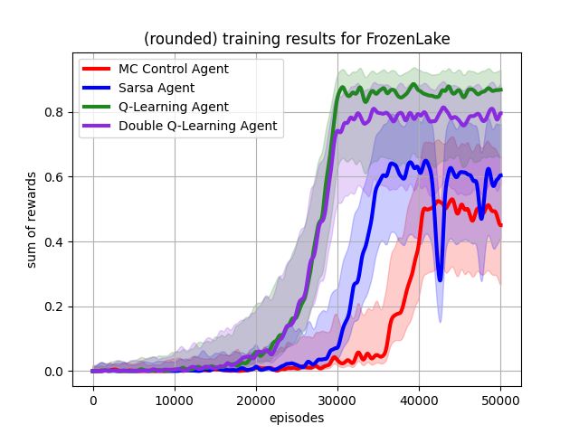
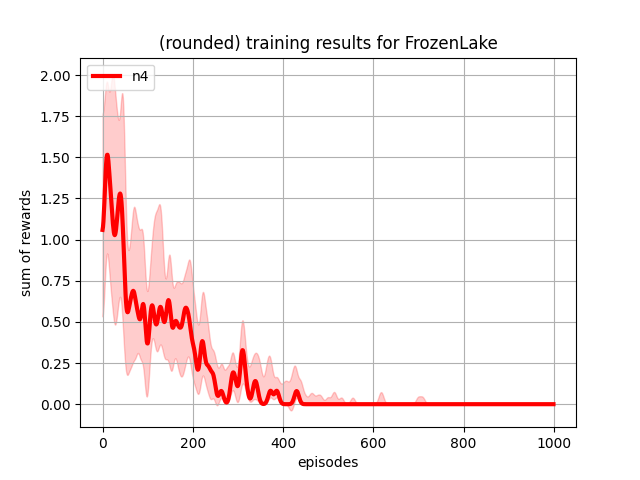
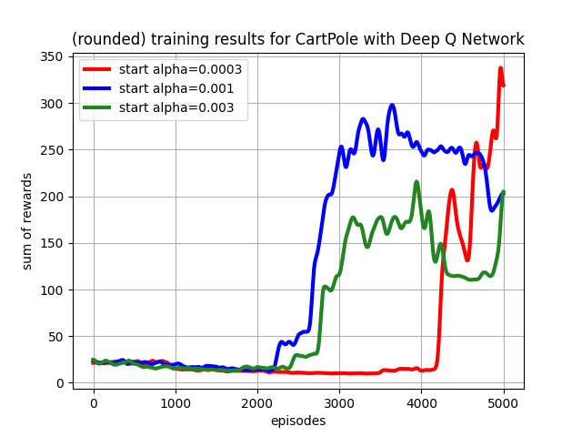
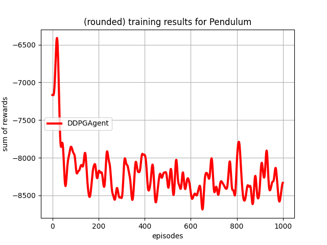
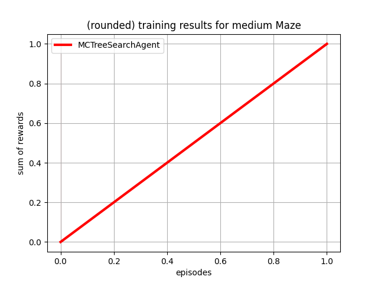

# Experiments

In general, all experiments follow the same structure: 

```python
from environments import DiscreteEnv
from agents import AbstractAgent
from train import train_agents
from utils import visualize_training_results_for_agents

# initialize environment
env = DiscreteEnv()

# create different agents, you want to train
agent1 = AbstractAgent(env)
agent2 = AbstractAgent(env)
agent3 = AbstractAgent(env)

# train list of agents on the same environment
stats = train_agents(env, [agent1, agent2, agent3])
# store the stats as a plot
visualize_training_results_for_agents(stats)
```

## Comparison

### Table based methods


### NTD prediction


### DQN hyperparameters


## Showcase

### Deep deterministic policy gradient agent


### Monte carlo tree search

  
