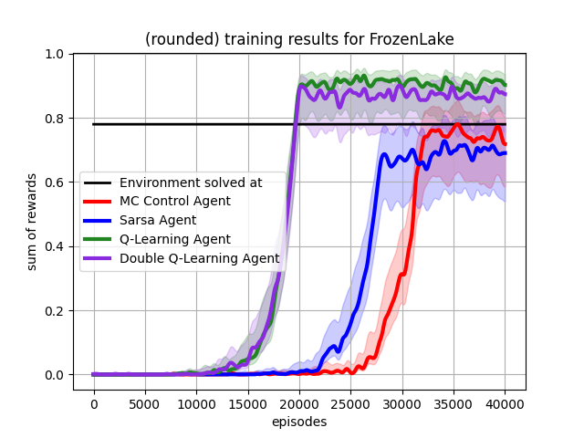
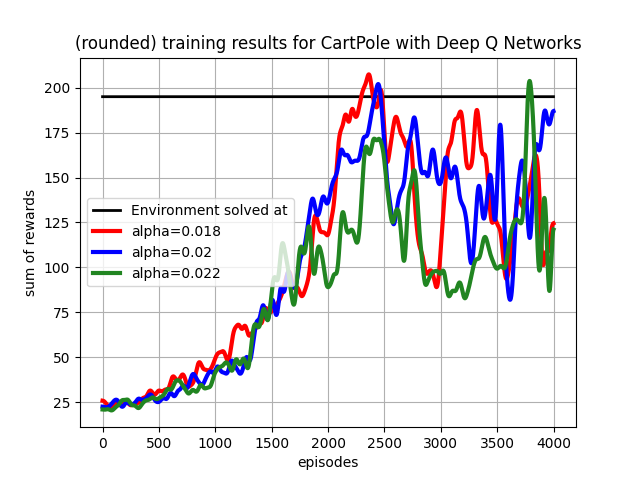
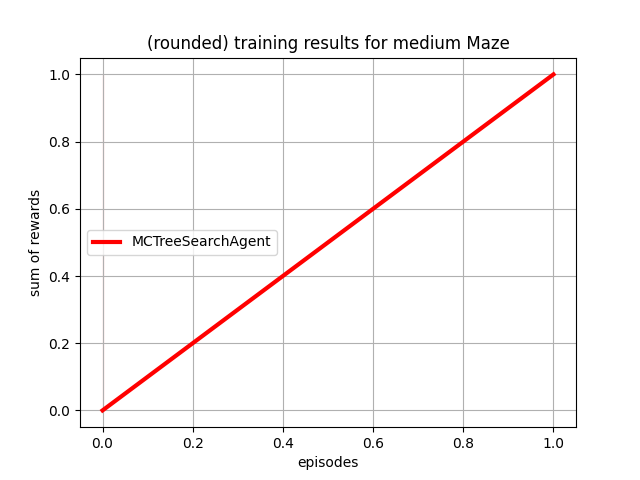

# Experiments

Methods can be compared with each other in their training behaviour.  

In general, all experiments follow the same structure: 

```python
from environments import DiscreteEnv
from agents import AbstractAgent
from train import train_agents
from utils import visualize_training_results_for_agents

# initialize environment
env = DiscreteEnv()

# create different agents you want to train
agent1 = AbstractAgent(env)
agent2 = AbstractAgent(env)
agent3 = AbstractAgent(env)

# train list of agents on the same environment
stats = train_agents(env, [agent1, agent2, agent3])
# save the stats as a plot
visualize_training_results_for_agents(stats)
```

## Comparison

This compares different agents with either different methods or parameters. 

### Table based methods
The test environment is the stochastic 4x4 FrozenLake, where the goal yields a reward of 1, and falling into a hole
results in a reward of 0.  

- Monte Carlo Control
- Sarsa
- Q-Learning
- Double Q-Learning

with adjusted parameters are compared to each other. The results are shown below. 



### N-Temporal difference prediction

On the stochastic 4x4 FrozenLake, different values for _n_ are compared with the same hyperparameters


### Deep Q-Network hyperparameters
For the same agent, the effect of learning rate on training effectiveness and speed is tested.   



## Showcase
These tests show that the corresponding method implementation works as intended. Comparisons would
take too many resources in my case, but they are possible. 

### Deep deterministic policy gradient agent
The environment of the pendulum has a continuous state and action space. Solving this shows that
the agent works as intended. 


### Monte carlo tree search
The action tree is expanded with each action. So MCTS doesn't need training (its rollout policy might). 
This is shown by the plot where the agent gets the maximum reward in the first training episode. 


  
