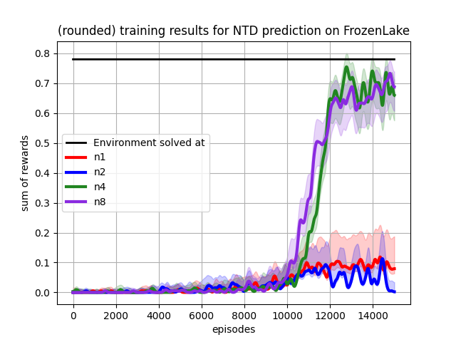

# Experiments

Methods can be compared with each other in their training behaviour.  

In general, all experiments follow the same structure: 

```python
from environments import DiscreteEnv
from agents import AbstractAgent
from train import train_agents
from utils import visualize_training_results_for_agents

# initialize environment
env = DiscreteEnv()

# create different agents you want to train
agent1 = AbstractAgent(env)
agent2 = AbstractAgent(env)
agent3 = AbstractAgent(env)

# train list of agents on the same environment
stats = train_agents(env, [agent1, agent2, agent3])
# save the stats as a plot
visualize_training_results_for_agents(stats)
```

## Comparisons

Here, either different methods or hyperparameters of the same method are compared to each other in 
training efficiency. As a metric the sum of rewards achieved in each episode is used.   

### Table based methods
The test environment is the stochastic 4x4 FrozenLake, where the goal yields a reward of 1, and falling into a hole
results in a reward of 0. Both observation space and action space are discrete and table based methods can be used. 

These methods got compared to each other with individually adjusted parameters: 
- Monte Carlo Control
- Sarsa
- Q-Learning
- Double Q-Learning

The results are shown below. 


### N-Temporal difference prediction

The same FrozenLake environment as of `Table based methods` is used to compare versions of N-TD prediction. 
N represents the amount of time steps that goes into consideration of the q-value target to update the q-table. 
Every agent uses the same hyperparameters, except the n-value. Results are shown below.   



### Deep Q-Network hyperparameters
The training environment is CartPole from openAI with continuous observation space and discrete actions. 
DQN-Agents are `from agents import DeepQNetworkAgent`. The same epsilon reduction and neural network structure
is used, but the learning rate `alpha` is different for each agent. 
The effect of learning rate on training effectiveness is compared.   


As shown in the plot, agent ... is the most consistent in reaching the goal of the environment of reward 475 per episode. 
Lower and higher learning rates cause either fluctuations or are unsuccessful in learning at all. 
Those results can change, when altering hyperparameters like epsilon decay, NN shape or amount of training episode.  


## Showcase
These tests show that the corresponding method implementation works as intended. Comparisons would
take too many resources in my case, but are also possible. 

### Deep deterministic policy gradient agent
The environment of the pendulum has a continuous state and action space. Solving this shows that
the agent works as intended. 


An example of one episode of the pendulum can be seen below:


### Monte carlo tree search
The action tree is expanded with each action. MCTS doesn't need training (its rollout policy might). 
Here a maze is used as environment, where the agent(red) has to reach the goal (green) and receives a positive reward. 
For collecting the treasures (yellow, magenta and cyan) the agent receives double the amount of the goal. Also there is
a hole (black), that will end the episode. 

The action tree is visualized by the red line in the following video. 


  
