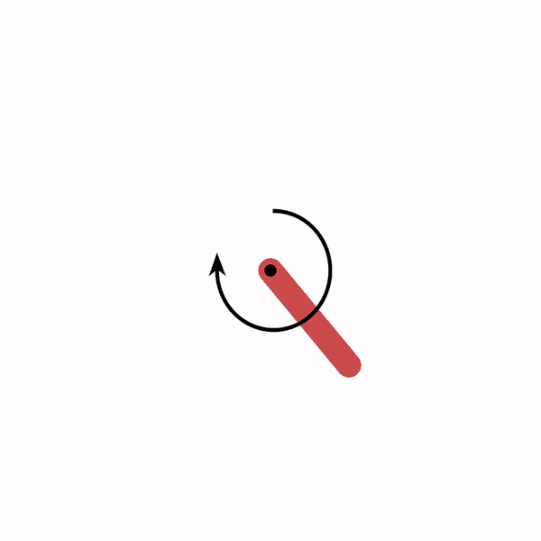

# Experiments
<!-- TODO: 1. DQN schaffen 2. MCTS Baum 3. DDPG schaffen  -->

Agents can be compared with each other in their training behaviour, or show, that the implementation is working as
intended. 

In general, experiments follow this structure: 

```python
from environments import DiscreteEnv
from agents import AbstractAgent
from train import train_agents
from utils import visualize_training_results_for_agents

# initialize environment
env = DiscreteEnv()

# create different agents you want to train
agent1 = AbstractAgent(env)
agent2 = AbstractAgent(env)
agent3 = AbstractAgent(env)

# train list of agents on the same environment
stats = train_agents(env, [agent1, agent2, agent3])
# save the stats as a plot
visualize_training_results_for_agents(stats)
```

## Comparisons

Here, either different methods or hyperparameters of the same method are compared to each other in 
training efficiency. As a metric the sum of rewards achieved in each episode is used.   

### [Table based methods](/experiments/comparison_table_based_methods.py)
The test environment is the stochastic 4x4 FrozenLake, where the goal yields a reward of 1, and falling into a hole
results in a reward of 0. Both observation space and action space are discrete and table based methods can be used. 

These methods got compared to each other with individually adjusted parameters: 
- [Monte Carlo Control](/agents/mc_control_agent.py)
- [Sarsa](/agents/sarsa_agent.py)
- [Q-Learning](/agents/q_learning_agent.py)
- [Double Q-Learning](/agents/double_q_learning_agent.py)

The results are shown below. 


### [N-Temporal difference prediction](/experiments/comparison_n_for_ntd_prediction.py)

The same FrozenLake environment as of `Table based methods` is used to compare versions of [N-TD Prediction](/agents/n_td_prediction_agent.py). 
N represents the amount of time steps that goes into consideration of the q-value target to update the q-table. 
Every agent uses the same hyperparameters, except the n-value. Results are shown below.   


### [Deep Q-Network hyperparameters](/experiments/comparison_dqn_hyperparameters.py)
The training environment is CartPole from openAI with continuous observation space and discrete actions. 
Three versions of a [Deep Q-Network](/agents/deep_q_network_agent.py) with the same epsilon reduction and neural network structure
are used, but the learning rate `alpha` is different for each agent. 
The effect of learning rate on training effectiveness is compared.   


As shown in the plot, agent with `alpha=0.019` is the most promising, but further hyperparameter tweaking has to be done.  


## Showcase
These tests show that the corresponding method implementation works as intended.

### [Dynamic Programming Agent](/experiments/showcase_dp.py)
DP-Agent updates its Q-Values due to knowledge of state transition probabilities
and reward probabilities. Applied to FrozenLake4x4 it results in: 

`Dynamic Programming Agent solved 83.0% of FrozenLake4x4 iterations`

### [Monte Carlo Tree Search](/experiments/showcase_mcts.py)
The action tree is expanded with each action. [Monte Carlo Tree Search](/agents/mc_tree_search_agent.py) doesn't need training (its rollout policy might). 
Here a maze is used as environment, where the agent(red) has to reach the goal (green) and receives a positive reward. 
For collecting the treasure (cyan) the agent receives double the amount of the goal. 

The action tree is visualized by the red line in the following video. 


### [Deep Deterministic Policy Gradient agent](/experiments/showcase_ddpg.py)
The environment of the pendulum has a continuous state and action space. Solving this shows that
the [Deep Deterministic Policy Gradient](/agents/deep_deterministic_policy_gradient_agent.py) works as intended. 

An example of one episode of the pendulum can be seen below:



  
